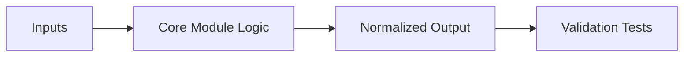

# Sprint 00 - Compliance Layer

## Objective
Establish hard safety boundaries so all later subsystems run under explicit legal and ethical controls.

## Source Code
- `src/nyxera_eye/compliance/runtime_mode.py`
- `src/nyxera_eye/compliance/scope.py`
- `src/nyxera_eye/compliance/target_blacklist.py`
- `src/nyxera_eye/compliance/opt_out_registry.py`
- `src/nyxera_eye/audit/logger.py`
- `src/nyxera_eye/ui/legal_banner.py`

## Logic Design
- `RuntimePolicy` is the top-level gatekeeper:
  - `PASSIVE` always rejects intrusive action.
  - `AUTHORIZED_SCOPE` delegates to CIDR allowlist checks.
- `ScopePolicy` validates and stores approved CIDRs, then checks target membership.
- `TargetBlacklist` performs normalized deny checks for explicit blocked assets.
- `OptOutRegistry` tracks owner opt-outs as first-class exclusion logic.
- `AuditLogger` persists JSON lines with UTC timestamps for forensic traceability.
- `legal_banner_text()` provides deterministic legal notice for interface layers.

## Architecture Impact
- Safety policy was implemented as reusable core modules, not UI-only controls.
- Compliance concerns are separated from collector logic to avoid policy bypass by implementation drift.
- Audit behavior is append-only file based and environment-independent.

## Validation Notes
- Coverage is in `tests/test_compliance.py`.
- Logging behavior and policy gating were validated with deterministic unit checks.

## Risks and Follow-ups
- Audit sink is local file only; external SIEM connectors are not yet implemented.
- Opt-out and blacklist are in-memory stores; persistence and sync are future work.

## Mermaid Diagram

