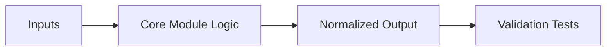

# Sprint 02 - OSINT Harvester Engine

## Objective
Implement normalized ingestion from Shodan, Censys, and ZoomEye with query orchestration and queue integration.

## Source Code
- `src/nyxera_eye/collectors/base.py`
- `src/nyxera_eye/collectors/shodan.py`
- `src/nyxera_eye/collectors/censys.py`
- `src/nyxera_eye/collectors/zoomeye.py`
- `src/nyxera_eye/collectors/dork_manager.py`
- `src/nyxera_eye/queue/redis_queue.py`
- `src/nyxera_eye/collectors/models.py`

## Core Logic
- Provider adapters normalize heterogeneous upstream payloads into `DeviceRecord`.
- `DorkManager` adds controlled category-based query rotation with per-category rate windows.
- `RedisTaskQueue.enqueue_osint_task()` pushes provider/query/page jobs for downstream workers.

## Data Contract
`DeviceRecord` fields:
- source, ip, port, protocol
- optional banner/org/country/timestamp

## Architecture Impact
- Collector layer isolated provider parsing from worker pipeline.
- Queue API establishes decoupling point between ingestion and processing.

## Validation Notes
- `tests/test_collectors.py` validates normalization and dork rotation logic.
- mock payloads in `tests/mocks/osint_payloads.py` prevent external dependency flakiness.

## Risks and Follow-ups
- Live provider compatibility depends on API schema stability; no live-contract checker yet.

## Mermaid Diagram

