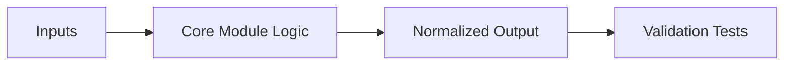

# Sprint 03 - Worker Framework

## Objective
Implement sequential worker pipeline for banner parsing, service detection, and enrichment.

## Source Code
- `src/nyxera_eye/workers/banner_parser.py`
- `src/nyxera_eye/workers/service_detection.py`
- `src/nyxera_eye/workers/device_enrichment.py`
- `src/nyxera_eye/workers/pipeline.py`

## Logic Breakdown
- `BannerParsingWorker`: trims and normalizes incoming banner payload.
- `ServiceDetectionWorker`:
  - uses static port hints (`80->http`, `502->modbus`, etc.)
  - then applies banner keyword override rules.
- `DeviceEnrichmentWorker` maps service to `risk_profile` and marks record as normalized.
- `ProcessingPipeline.process_record()` composes the three stages in order.

## Architecture Impact
- Worker chain defines deterministic transform path from raw collector output to normalized operational record.
- Batch execution (`process_batch`) allows future queue fan-out integration.

## Validation Notes
- `tests/test_workers.py` validates final normalized output invariants.

## Risks and Follow-ups
- Enrichment heuristic is rule-based; no probabilistic confidence scoring yet.

## Mermaid Diagram

