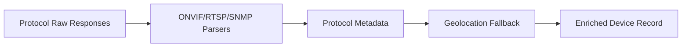

# Sprint 06 - IoT Protocol Enrichment

## Objective
Add protocol-specific metadata extraction for ONVIF, RTSP, and SNMP with geolocation fallback logic.

## Source Code
- `src/nyxera_eye/protocols/onvif_discovery.py`
- `src/nyxera_eye/protocols/rtsp_probe.py`
- `src/nyxera_eye/protocols/snmp_metadata.py`
- `src/nyxera_eye/enrichment/geolocation.py`

## Logic
- ONVIF parser converts WS-discovery probe-match fields into typed object.
- RTSP parser extracts server identity and supported methods from `Public` header.
- SNMP extractor only allows safe mode and maps key OIDs (`sysName`, `sysDescr`, `sysContact`).
- Geolocation prioritizes MaxMind fields, falling back to IPInfo when missing.

## Architecture Impact
- Protocol modules are parser-oriented and avoid intrusive network operations.
- Enrichment can be composed after worker normalization and before schema persistence.

## Validation Notes
- `tests/test_protocols.py`

## Mermaid Diagram

