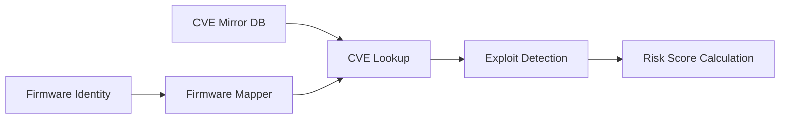

# Sprint 07 - Vulnerability Intelligence

## Objective
Implement local CVE mirror, firmware-to-CVE mapping, exploit availability detection, and risk scoring.

## Source Code
- `src/nyxera_eye/vulnintel/cve_mirror.py`
- `src/nyxera_eye/vulnintel/firmware_mapping.py`
- `src/nyxera_eye/vulnintel/exploit_detection.py`
- `src/nyxera_eye/vulnintel/risk_score.py`

## Logic
- CVE mirror uses SQLite with upsert semantics by `cve_id`.
- Firmware mapper keys vulnerabilities by normalized `(vendor, model, firmware)` tuple.
- Exploit detection checks 3 sources in order:
  1. CISA KEV inclusion
  2. ExploitDB mapping presence
  3. EPSS threshold
- Risk score formula:
  - `cvss + (epss * 10) + exploit_bonus + exposure_level`
  - exploit bonus is `1.5` when available.

## Architecture Impact
- Vulnerability intelligence layer is data-source agnostic and can work offline with mirrored datasets.

## Validation Notes
- `tests/test_vulnintel.py`

## Mermaid Diagram

