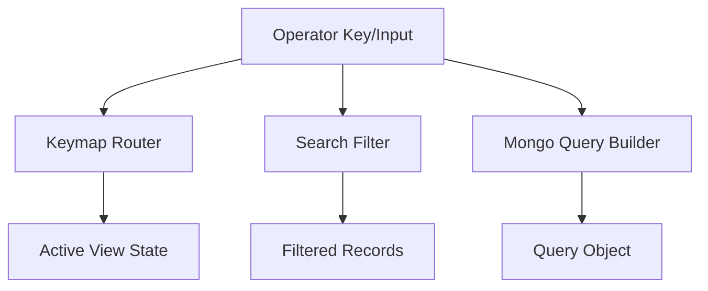

# Sprint 08 - Operator TUI

## Objective
Deliver keyboard-driven operator interface primitives: navigation, search-as-you-type, and query construction.

## Source Code
- `src/nyxera_eye/tui/app.py`
- `src/nyxera_eye/tui/keymap.py`
- `src/nyxera_eye/tui/search.py`
- `src/nyxera_eye/tui/mongo_query.py`

## Logic
- `NyxeraSpeedTUI` orchestrates shortcuts and filtering behavior.
- `handle_shortcut()` maps keys to views (`scan`, `pivot`, `vulnerabilities`, `map`).
- `search_as_you_type()` performs case-insensitive value aggregation and substring filtering.
- `MongoQueryInterface` interprets `field:value` shorthand and text query fallback.

## Architecture Impact
- UI logic is split into pure helper modules, enabling unit-level validation without UI runtime.

## Validation Notes
- `tests/test_tui.py`

## Mermaid Diagram

