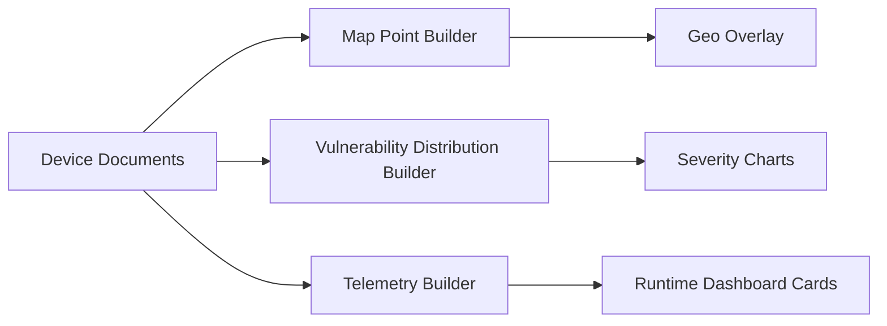

# Sprint 10 - Command Center

## Objective
Provide map/distribution/telemetry data builders for global command center visualizations.

## Source Code
- `src/nyxera_eye/api/command_center.py`
- `src/nyxera_eye/api/app.py` (command-center endpoints)

## Logic
- `build_global_exposure_map_points()` flattens records for map plotting.
- `build_vulnerability_distribution()` counts severities using normalized lowercase keys.
- `build_mining_telemetry()` rounds throughput/latency metrics for stable UI presentation.

## Architecture Impact
- Visualization builders remain deterministic transformation functions.
- Endpoint layer separates ingestion from representation.

## Validation Notes
- `tests/test_command_center.py`

## Mermaid Diagram

