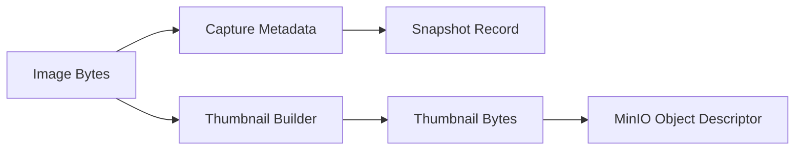

# Sprint 11 - Media Intelligence

## Objective
Implement metadata-only snapshot handling and MinIO thumbnail object preparation.

## Source Code
- `src/nyxera_eye/media/snapshot_capture.py`
- `src/nyxera_eye/media/minio_thumbnail_store.py`

## Logic
- `SnapshotCapture.capture_metadata()` records capture timestamp, MIME type, and byte size.
- `build_thumbnail()` truncates payload to max size for lightweight preview use.
- `MinIOThumbnailStore.object_key()` creates deterministic object path by device/timestamp.
- `prepare_upload()` returns object descriptor without direct network side-effects.

## Architecture Impact
- Media pipeline keeps generation and storage transport concerns separated.

## Validation Notes
- `tests/test_media.py`

## Mermaid Diagram

