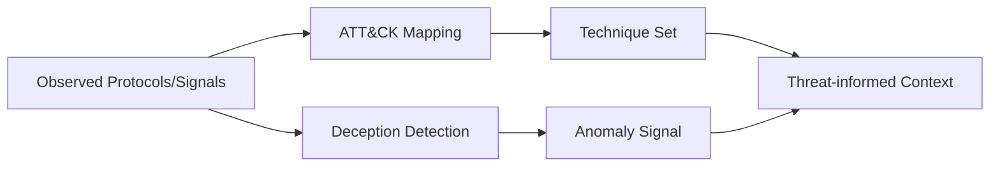

# Sprint 12 - Adversary Emulation Intelligence

## Objective
Map protocol surface to ATT&CK-aligned techniques and detect deception anomalies.

## Source Code
- `src/nyxera_eye/adversary/attack_mapping.py`
- `src/nyxera_eye/adversary/deception_detection.py`

## Logic
- Protocol mapping table translates observed protocol families to technique IDs.
- Deception engine computes three anomaly dimensions:
  - TCP jitter anomaly (spread threshold)
  - banner inconsistency (set cardinality)
  - timing anomaly (peak vs average)
- `DeceptionSignal.suspicious` returns aggregated boolean state.

## Architecture Impact
- Adversary analytics remain read-only and inference-driven.
- Outputs are composable with operator prioritization and alert logic.

## Validation Notes
- `tests/test_adversary.py`

## Mermaid Diagram

