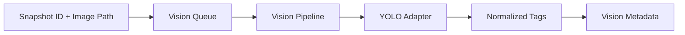

# Sprint 13 - Vision Intelligence Workers

## Objective
Add snapshot-to-AI queue processing and normalized YOLO tag extraction with dataset threshold validation.

## Source Code
- `src/nyxera_eye/vision/ai_queue.py`
- `src/nyxera_eye/vision/pipeline.py`
- `src/nyxera_eye/vision/worker.py`
- `src/nyxera_eye/vision/yolo_adapter.py`
- `src/nyxera_eye/vision/tags.py`
- `src/nyxera_eye/vision/validation.py`

## Logic
- `VisionQueue` stores `VisionQueueItem` payloads (`snapshot_id`, `image_path`).
- `VisionPipeline` enqueues snapshots and processes next queue item via worker.
- `YoloAdapter.normalize_detections()` enforces supported tags and positive confidence.
- `VisionWorker` returns typed `VisionMetadata` for downstream storage/indexing.
- `validate_dataset_size()` enforces minimum image threshold for validation gate.

## Architecture Impact
- Vision stack is isolated from media capture and can be swapped to real model inference backend.

## Validation Notes
- `tests/test_vision.py`

## Mermaid Diagram

