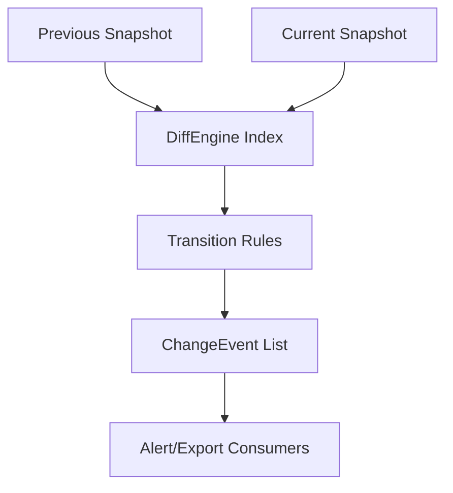

# Sprint 14 - Change Detection Engine

## Objective
Detect state transitions across device snapshots: secure-to-vulnerable, firmware changes, disappear/reappear events.

## Source Code
- `src/nyxera_eye/change_detection/diff_engine.py`

## Logic
- Inputs are indexed by `device_id` for previous/current snapshots.
- Transition logic emits `ChangeEvent` entries for:
  - `secure_to_vulnerable`
  - `firmware_changed`
  - `device_disappeared`
  - `device_reappeared` (uses historical `_known_device_ids`)
- Firmware compare normalizes empty values and ignores null/blank deltas.

## Architecture Impact
- Diff engine is stateful by design and can power alerting and reporting modules.

## Validation Notes
- `tests/test_change_detection.py`

## Mermaid Diagram

