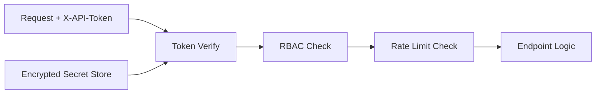

# Sprint 15 - Security Hardening

## Objective
Introduce RBAC, API tokens, encrypted secret payloads, and per-subject rate limiting.

## Source Code
- `src/nyxera_eye/security/rbac.py`
- `src/nyxera_eye/security/api_tokens.py`
- `src/nyxera_eye/security/encrypted_secrets.py`
- `src/nyxera_eye/security/rate_limit.py`
- `src/nyxera_eye/api/app.py` (auth dependency integration)

## Logic
- RBAC uses numeric role priorities with `role_allows()` comparisons.
- Token store:
  - issues random token strings
  - stores SHA-256 token hashes only
  - supports revoke/verify
  - encrypted export/load for persistence transport
- Secret encryption:
  - key derivation with SHA-256
  - stream XOR keystream by nonce+counter
  - HMAC-SHA256 integrity verification
- Rate limiter:
  - sliding window deque per subject
  - enforces max requests per time window
- API endpoints enforce minimum roles and rate limits via FastAPI dependencies.

## Architecture Impact
- Security is centralized in reusable module layer and injected into API boundary.

## Validation Notes
- `tests/test_security.py`

## Mermaid Diagram

