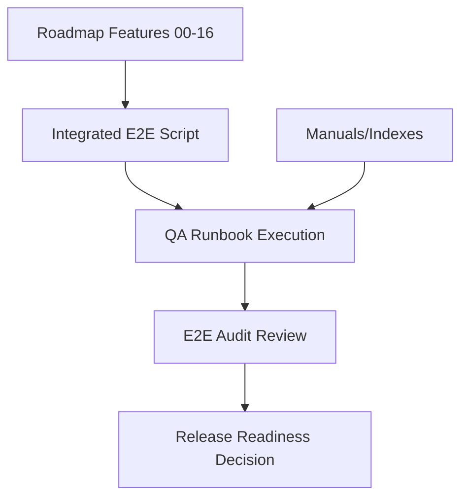

# Sprint 17 - Final Validation and Release Readiness

## Objective
Run integrated full-chain validation and produce operator-ready QA/release documentation.

## Source Code and Docs
- `scripts/e2e_full_validation.py`
- `docs/RUNBOOK.md`
- `docs/E2E_AUDIT.md`
- `docs/manuals/` documentation set

## Validation Logic
`e2e_full_validation.py` executes deterministic cross-phase checks covering implemented features:
- compliance and audit controls
- collector normalization and queue enqueue behavior
- processing pipeline and enrichment
- schema migration/validation
- fingerprinting and clustering
- protocol and vulnintel flows
- TUI/API command-center builders
- media, adversary, vision, change detection
- security and observability modules

## QA Logic
- `RUNBOOK.md` defines repeatable manual execution sequence, prerequisites, expected outputs, and pass/fail criteria.
- `E2E_AUDIT.md` captures current test architecture risks and hardening tasks.

## Architecture Impact
- Sprint 17 formalizes validation as a first-class artifact, not ad-hoc test commands.
- Documentation index enables onboarding and operational continuity.

## Current State
- Deterministic local E2E path: implemented and passing.
- Live external-provider E2E: not yet a default gate (documented as follow-up in audit).

## Mermaid Diagram

