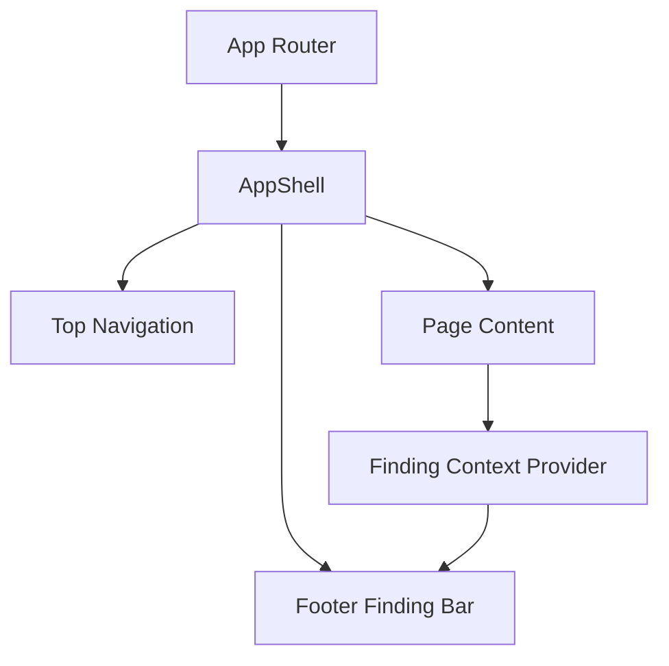

# Sprint 18 - Frontend UX Foundation

## Objective
Establish production-ready frontend shell using Next.js + Tailwind with persistent navigation and finding-action context.

## Source Code
- `frontend/package.json`
- `frontend/app/layout.tsx`
- `frontend/app/components/app-shell.tsx`
- `frontend/app/components/top-nav.tsx`
- `frontend/app/components/footer-finding-bar.tsx`
- `frontend/app/components/finding-context.tsx`
- `frontend/app/page.tsx`
- `frontend/app/events/page.tsx`
- `frontend/app/findings/page.tsx`

## Logic
- `AppShell` wraps all routes with a consistent UI frame.
- Top nav is persistent and route-aware.
- Selected finding state is global via React context.
- Footer bar always shows selected finding details and action buttons.
- Dashboard/events/findings routes were split to support task-focused workflows.

## Architecture Impact
- Frontend moved from single-page placeholder to app-router multi-page architecture.
- Shared layout guarantees consistent UX primitives across pages.

## Validation Notes
- Static route/component verification via file-level integration.
- Manual UX checks performed through local Next.js dev run (`npm run dev`).

## Mermaid Diagram

