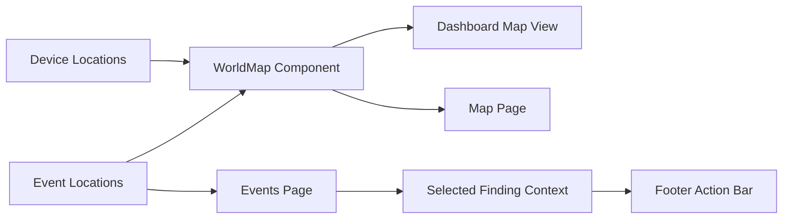

# Sprint 19 - Geospatial Intelligence UX

## Objective
Implement world map visualization showing both device geolocations and event geolocations, with finding selection workflow integration.

## Source Code
- `frontend/app/components/world-map.tsx`
- `frontend/app/lib/data.ts`
- `frontend/app/lib/types.ts`
- `frontend/app/map/page.tsx`
- `frontend/app/events/page.tsx`
- `frontend/app/findings/page.tsx`

## Logic
- Geographic projection uses equirectangular percentage conversion from `(lat, lon)` to map coordinates.
- Device markers and event markers are rendered as distinct layers (`D`, `E`) with severity visual hints.
- Events page binds event rows to corresponding findings for global footer actions.
- Findings page provides direct selection and persistent action context.

## Architecture Impact
- Introduced reusable geospatial component for dashboard and dedicated map page.
- Linked event intelligence with operator action workflow instead of isolated visual output.

## Validation Notes
- Manual UI inspection path:
  - `/` dashboard map snapshot
  - `/map` full overlays
  - `/events` finding selection
  - `/findings` action context sync

## Mermaid Diagram

