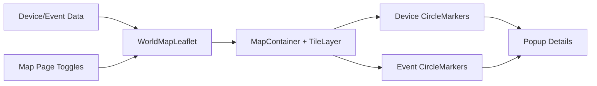

# Sprint 20 - Interactive Leaflet Map Runtime

## Objective
Move from a visual placeholder map to a real interactive geospatial runtime using Leaflet and OpenStreetMap tiles.

## Source Code
- `frontend/package.json`
- `frontend/app/components/world-map-leaflet.tsx`
- `frontend/app/page.tsx`
- `frontend/app/map/page.tsx`
- `frontend/app/layout.tsx`

## Logic
- Added `leaflet` and `react-leaflet` dependencies.
- Introduced `WorldMapLeaflet` client component:
  - renders `MapContainer` and OSM tile layer
  - plots device markers with severity color coding
  - plots event markers as distinct overlay style
  - shows popup details on marker interaction
- Map page now supports overlay toggles for devices/events.
- Dashboard uses interactive map snapshot instead of static decorative block.

## Architecture Impact
- Frontend geospatial system now has a real runtime integration boundary suitable for future backend-fed live data.
- Marker payload contracts are centralized in `frontend/app/lib/types.ts` and `frontend/app/lib/data.ts`.

## Validation Notes
- Component-level validation via route wiring:
  - `/` dashboard map rendered through dynamic client import
  - `/map` toggle behavior for overlays
- Compose/API stack remains independent from frontend map runtime.

## Mermaid Diagram

